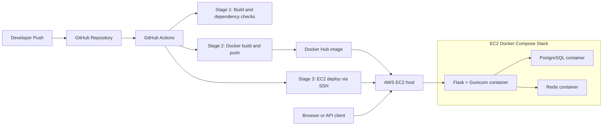

# ShieldGuard Pro

[](https://www.python.org/)
[](https://flask.palletsprojects.com/)
[](https://www.postgresql.org/)
[](https://www.docker.com/)
[](https://hub.docker.com/r/abhiishek25/shieldguard-pro)
[](https://github.com/abhishek-balsure/phishing-detector-pro/actions)
[](https://opensource.org/licenses/MIT)

ShieldGuard Pro is a Flask-based phishing detection platform that combines machine learning URL analysis with user accounts, scan history, bookmarks, JWT-secured REST APIs, PostgreSQL persistence, Redis-backed rate limiting, and Docker-based deployment.

## Live Links

- Application: [http://35.154.32.25:5000](http://35.154.32.25:5000)
- Docker Hub: [https://hub.docker.com/r/abhiishek25/shieldguard-pro](https://hub.docker.com/r/abhiishek25/shieldguard-pro)
- GitHub Actions: [Repository workflow runs](https://github.com/abhishek-balsure/phishing-detector-pro/actions)

## Features

- URL, batch, email, and QR phishing analysis
- Random Forest-based phishing prediction with feature extraction
- User accounts, dashboard, bookmarks, achievements, and admin views
- PostgreSQL-backed application data
- JWT-secured REST API for programmatic access
- Redis-backed rate limiting for global, login, and API traffic controls
- Docker Compose deployment for app, database, and Redis
- GitHub Actions pipeline with Docker image publishing and EC2 deployment

## Tech Stack

| Category | Technologies |
|---|---|
| Backend | Python 3.11, Flask, Gunicorn |
| Machine Learning | scikit-learn, NumPy, pandas |
| Database | PostgreSQL |
| Cache / Rate Limiting | Redis, Flask-Limiter |
| Authentication | Flask sessions, JWT (`flask-jwt-extended`) |
| Frontend | HTML, Bootstrap 5, JavaScript |
| Containerization | Docker, Docker Compose |
| CI/CD | GitHub Actions, Docker Hub |
| Hosting | AWS EC2 |

## Architecture



## Project Structure

```text
phishing-detector-pro/
|-- app.py
|-- feature_extraction.py
|-- phishing_model.pkl
|-- requirements.txt
|-- Dockerfile
|-- docker-compose.yml
|-- .env
|-- .github/
|   `-- workflows/
|       `-- deploy.yml
|-- templates/
`-- static/
```

## Local Development

### Prerequisites

- Python 3.11+
- pip
- PostgreSQL
- Redis

### Run locally without Docker

```bash
git clone https://github.com/abhishek-balsure/phishing-detector-pro.git
cd phishing-detector-pro

python -m venv venv
source venv/bin/activate
# Windows PowerShell: .\venv\Scripts\Activate.ps1

pip install -r requirements.txt
python app.py
```

Open `http://localhost:5000`.

## Docker Deployment

The current Compose stack includes:

- `web` - Flask app served by Gunicorn
- `db` - PostgreSQL 15
- `redis` - Redis 7 for rate-limit storage

### Start with Docker Compose

```bash
git clone https://github.com/abhishek-balsure/phishing-detector-pro.git
cd phishing-detector-pro

docker-compose up --build -d
```

### Check containers

```bash
docker-compose ps
docker-compose logs -f web
```

### Stop the stack

```bash
docker-compose down
```

### Rebuild after changes

```bash
docker-compose up --build -d
```

### Environment variables

Set these in `.env` before deployment:

```env
SECRET_KEY=your-flask-secret
JWT_SECRET_KEY=your-jwt-secret
DATABASE_URL=postgresql://user:password@db:5432/dbname
POSTGRES_DB=dbname
POSTGRES_USER=user
POSTGRES_PASSWORD=password
REDIS_URL=redis://redis:6379/0
FLASK_ENV=production
```

## AWS EC2 Deployment

The GitHub Actions workflow deploys to EC2 over SSH after publishing the Docker image.

### Manual EC2 setup

1. Launch an Ubuntu EC2 instance.
2. Open inbound security group rules for:
   - `22` for SSH
   - `5000` for the application
3. Install Docker and Docker Compose.
4. Copy the project or create a deployment directory on the server.
5. Add the `.env` file with production secrets.

### Install Docker on Ubuntu

```bash
sudo apt-get update
sudo apt-get install -y docker.io docker-compose-plugin
sudo systemctl enable docker
sudo systemctl start docker
sudo usermod -aG docker $USER
```

### Deploy on EC2

```bash
git clone https://github.com/abhishek-balsure/phishing-detector-pro.git
cd phishing-detector-pro

docker-compose pull
docker-compose up -d
```

### Update an existing deployment

```bash
cd ~/phishing-detector-pro
git pull
docker-compose pull
docker-compose up -d --build
docker image prune -f
```

## CI/CD Pipeline

The repository workflow in `.github/workflows/deploy.yml` runs a three-stage pipeline:

### Stage 1: Build and dependency validation

- Checks out the repository
- Sets up Python 3.11
- Installs system and Python dependencies
- Runs a basic import-based health check

### Stage 2: Docker build and publish

- Logs in to Docker Hub
- Builds the production image from `Dockerfile`
- Pushes `abhiishek25/shieldguard-pro:latest` to Docker Hub

### Stage 3: EC2 deployment

- Connects to the EC2 instance over SSH
- Pulls the latest Compose images
- Restarts the stack with Docker Compose
- Prunes unused images

### Required GitHub secrets

- `DOCKERHUB_USERNAME`
- `DOCKERHUB_TOKEN`
- `EC2_HOST`
- `EC2_SSH_KEY`

## API Documentation

The API is served from the same Flask application as the web UI.

### Authentication

- `POST /api/register` creates a user and returns a JWT
- `POST /api/login` returns a JWT for an existing user
- JWT expiry is `24 hours`
- Protected endpoints require:

```http
Authorization: Bearer <token>
```

### Rate limits

- Global: `100 requests/hour per IP`
- Login endpoints: `5 requests/minute per IP`
- Protected API endpoints: `20 requests/minute per authenticated user`
- Rate-limited responses return `429 Too Many Requests` with `Retry-After`

### Endpoints

#### `POST /api/register`

Create an account and receive a token.

Request:

```json
{
  "username": "apitester",
  "email": "apitester@example.com",
  "password": "StrongPass1",
  "confirm_password": "StrongPass1"
}
```

Response:

```json
{
  "message": "Account created successfully",
  "access_token": "jwt-token",
  "token_type": "Bearer",
  "expires_in": 86400,
  "user": {
    "id": 2,
    "username": "apitester",
    "email": "apitester@example.com",
    "is_admin": false
  }
}
```

#### `POST /api/login`

Request:

```json
{
  "username": "apitester",
  "password": "StrongPass1"
}
```

#### `POST /api/check_url`

Protected endpoint for single URL analysis.

Request:

```json
{
  "url": "https://example.com"
}
```

#### `POST /api/batch_check`

Protected endpoint for multiple URLs.

Request:

```json
{
  "urls": [
    "https://example.com",
    "https://another-example.com"
  ]
}
```

#### `GET /api/stats`

Returns system-wide counts for users and scans.

### Example curl usage

Register:

```bash
curl -X POST http://35.154.32.25:5000/api/register \
  -H "Content-Type: application/json" \
  -d '{"username":"apitester","email":"apitester@example.com","password":"StrongPass1","confirm_password":"StrongPass1"}'
```

Login:

```bash
curl -X POST http://35.154.32.25:5000/api/login \
  -H "Content-Type: application/json" \
  -d '{"username":"apitester","password":"StrongPass1"}'
```

Check a URL:

```bash
curl -X POST http://35.154.32.25:5000/api/check_url \
  -H "Content-Type: application/json" \
  -H "Authorization: Bearer YOUR_TOKEN" \
  -d '{"url":"https://example.com"}'
```

Batch check:

```bash
curl -X POST http://35.154.32.25:5000/api/batch_check \
  -H "Content-Type: application/json" \
  -H "Authorization: Bearer YOUR_TOKEN" \
  -d '{"urls":["https://example.com","https://another-example.com"]}'
```

## Security Notes

- Passwords are hashed before storage
- API authentication uses JWT
- Server-side sessions protect the web app
- PostgreSQL queries use parameterized execution
- Redis-backed rate limiting reduces brute-force and API abuse risk
- Default credentials are not documented and should not be relied on in any deployment

## License

This project is licensed under the MIT License.
